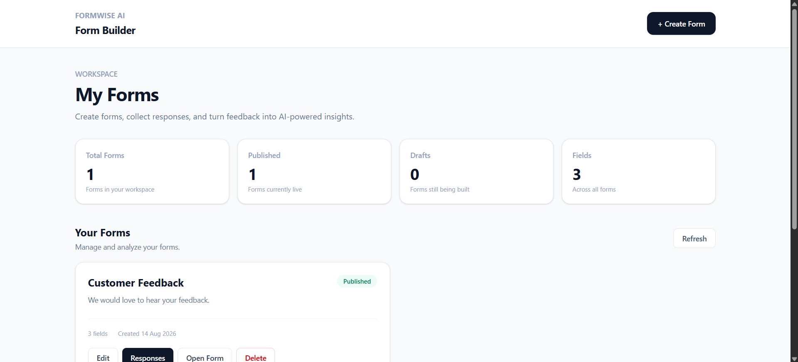
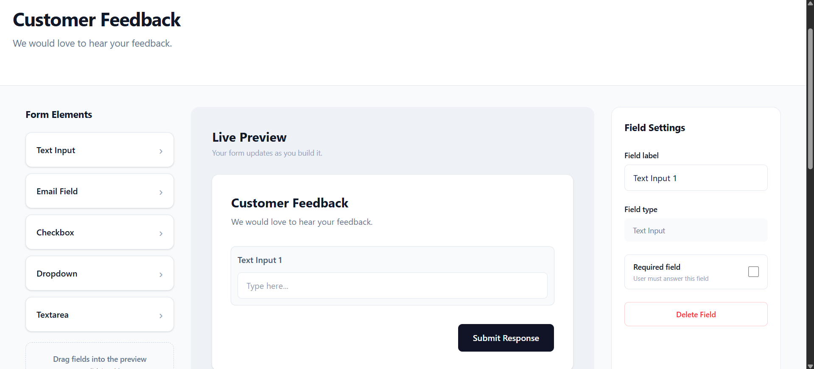
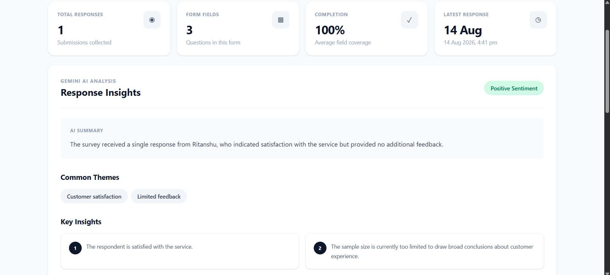
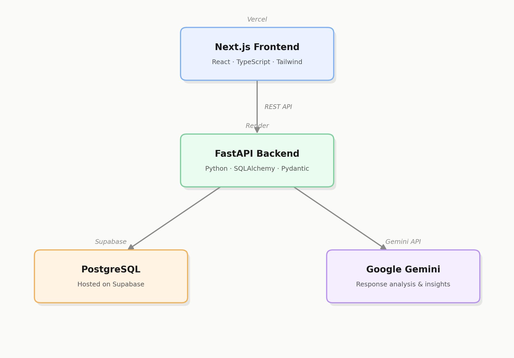

# FormWise AI

A form builder where you can create and publish forms, share them with respondents, and get AI-generated insights from the responses instead of reading through them one by one.

**Live app:** https://formwise-ai-seven.vercel.app/
**API docs:** https://formwise-ai-backend.onrender.com/docs
**Source:** https://github.com/Ritanshu-Kumar/formwise-ai



---

## Why I built this

I wanted a small end-to-end project that touched a real frontend, a real backend, a database, and an LLM integration — not just a CRUD app. Forms felt like a good fit because the interesting part isn't the form builder itself, it's what happens after people respond: normally you'd have to read every single answer to find patterns. Wiring up Gemini to summarize sentiment, themes, and recommendations across all responses was the part I actually wanted to build.

---

## Features

**Form builder**
- Create and edit forms with text, email, textarea, dropdown, and checkbox fields
- Mark fields as required, reorder or delete them, edit dropdown/checkbox options
- Live preview while building



**Publishing & responses**
- Publish a form to get a shareable public URL
- Collect and store responses in PostgreSQL
- View all responses or drill into an individual submission

**AI analysis**
- Runs collected responses through Gemini
- Returns a summary, sentiment, common themes, key insights, and recommendations



---

## Architecture



The frontend talks to the FastAPI backend over REST. The backend owns everything else — form/response storage in Postgres and sending response data to Gemini for analysis.

---

## Tech Stack

| Layer | Stack |
|---|---|
| Frontend | Next.js, React, TypeScript, Tailwind CSS |
| Backend | Python, FastAPI, SQLAlchemy, Pydantic, Uvicorn |
| Database | PostgreSQL (Supabase) |
| AI | Google Gemini (Google GenAI Python SDK) |
| Hosting | Vercel (frontend), Render (backend), Supabase (DB) |

---

## Project Structure

```
formwise-ai/
├── backend/
│   ├── app/
│   │   ├── routes/        # forms.py, responses.py, analysis.py
│   │   ├── services/      # ai.py — Gemini integration
│   │   ├── database.py
│   │   ├── models.py
│   │   ├── schemas.py
│   │   └── main.py
│   └── requirements.txt
│
├── frontend/
│   ├── app/
│   │   ├── form/[formId]/           # public form view
│   │   ├── forms/
│   │   │   ├── new/
│   │   │   ├── [formId]/edit/
│   │   │   └── [formId]/responses/
│   │   └── page.tsx
│   ├── lib/forms.ts
│   └── types/forms.ts
│
└── docs/
```

---

## API

Full interactive docs (Swagger) are at `/docs` on the backend. The main routes:

```
GET/POST              /api/forms
GET/PUT/DELETE        /api/forms/{form_id}
POST                  /api/forms/{form_id}/publish
POST                  /api/forms/{form_id}/analyze
GET                   /health
```

---

## Running Locally

**Requirements:** Python 3.12+, Node.js, PostgreSQL, a Gemini API key

```bash
git clone https://github.com/Ritanshu-Kumar/formwise-ai.git
cd formwise-ai
```

**Backend**

```bash
cd backend
python -m venv .venv
.venv\Scripts\Activate.ps1   # Windows; use source .venv/bin/activate on macOS/Linux
pip install -r requirements.txt
```

Create `backend/.env`:

```
DATABASE_URL=your_postgresql_connection_string
GEMINI_API_KEY=your_gemini_api_key
```

```bash
uvicorn app.main:app --reload --port 8000
```

Runs at `http://127.0.0.1:8000`, docs at `/docs`.

**Frontend**

```bash
cd frontend
npm install
```

Create `frontend/.env.local`:

```
NEXT_PUBLIC_API_URL=http://127.0.0.1:8000
```

```bash
npm run dev
```

Runs at `http://localhost:3000`.

> Don't commit `.env` files or API keys.

---

## Database

**Forms** — id, title, description, fields, published status, timestamps
**Responses** — id, form id, submitted answers, submission time (linked to a form)

---

## What's Next

- User authentication and multiple workspaces
- Conditional form logic
- CSV/PDF export of responses
- Embeddable forms

---

## Author

**Ritanshu Kumar** — [github.com/Ritanshu-Kumar](https://github.com/Ritanshu-Kumar)

Personal project, currently unlicensed.